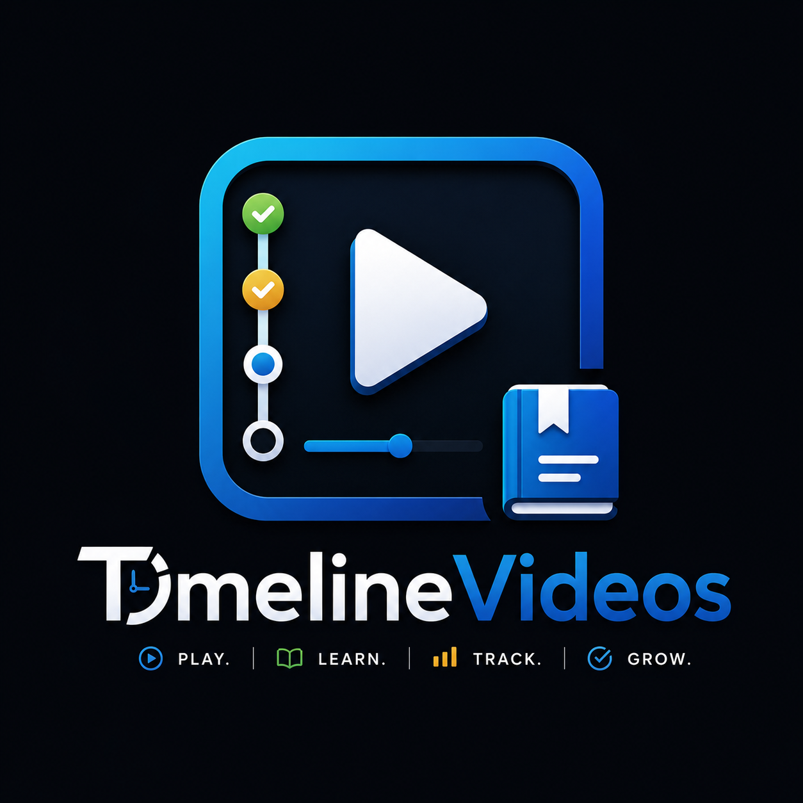

<div align="center">
  
  <h1 align="right" dir="rtl">⏱ TimelineVideo</h1>
  <p align="right" dir="rtl"><b>مشغل فيديوهات تعليمي ذكي مع تتبع التقدّم وإدارة قوائم التشغيل</b></p>

  <p dir="rtl">
    
    
    
    
    
    
  </p>

  <p dir="rtl">
    <a href="#المميزات">✨ المميزات</a> •
    <a href="#متطلبات-التشغيل">📋 المتطلبات</a> •
    <a href="#طريقة-التثبيت">⬇️ التثبيت</a> •
    <a href="#طريقة-البناء-من-الكود-المصدري">🔧 البناء</a> •
    <a href="#اختصارات-لوحة-المفاتيح">⌨️ الاختصارات</a> •
    <a href="#دعم-فلسطين">🍉 دعم فلسطين</a>
  </p>
</div>

---

<div dir="rtl">

## ✨ المميزات

| الميزة | الوصف |
|--------|-------|
| 🎬 **مشغل فيديو متكامل** | يستخدم VLC لتشغيل جميع الصيغ المدعومة (MP4, AVI, MKV, MOV, وغيرها) |
| 📂 **إدارة قوائم التشغيل** | إنشاء وتحرير وحذف قوائم تشغيل متعددة بسهولة |
| 📊 **تتبع التقدّم** | يحفظ وقت التوقف تلقائياً ويعود من نفس النقطة عند التشغيل التالي |
| ✅ **تحديد المكتمل** | إمكانية وضع علامة اكتمال على الفيديوهات لمشاهدتها أو إخفائها |
| 🔍 **بحث وفرز** | بحث سريع داخل الفيديوهات وفرز حسب الاسم أو الرقم |
| 🌓 **وضعان للعرض** | عرض شبكي (Grid) أو عرض قائمة (List) |
| 🎨 **ثيمات مظلمة** | ثيم Default Dark الأصلي وثيم Dracula الأنيق |
| ↔️ **دعم كامل للغة العربية** | واجهة من اليمين إلى اليسار (RTL) مع ترجمة كاملة |
| 🖥️ **شاشة كاملة ذكية** | عند الدخول في وضع ملء الشاشة تظهر قائمة التشغيل على اليمين |
| 🎯 **التحكم بالسرعة** | تشغيل الفيديو بسرعات مختلفة (0.25x إلى 2x) |
| 🎨 **أيقونات SVG احترافية** | جميع الأزرار مزودة بأيقونات متجهة عالية الجودة |
| 🍉 **دعم فلسطين** | رابط مباشر لدعم القضية الفلسطينية من قائمة المساعدة |

## 📋 متطلبات التشغيل

- **نظام التشغيل:** Windows 7/8/10/11 (64-bit)
- **VLC Media Player** — يجب تثبيته (الإصدار 3.x أو أحدث)
  - [تحميل VLC من الموقع الرسمي](https://www.videolan.org/vlc/)
- **CPU:** معالج ثنائي النواة 1.5GHz أو أسرع
- **الذاكرة:** 512MB RAM على الأقل (يوصى بـ 1GB)
- **المساحة:** ~50MB للتطبيق + مساحة للبيانات والصور المصغرة

## ⬇️ طريقة التثبيت

### الخيار 1: مثبّت MSI (مستحسن)

1. اذهب إلى [آخر إصدار](https://github.com/RaGAEIDOS/TimelineVideos/releases/latest)
2. حمّل ملف `TimelineVideo-1.0.0-x64.msi`
3. شغّله واتبع التعليمات
4. سيتم تثبيت التطبيق والاختصارات تلقائياً

### الخيار 2: تشغيل محمول (Portable)

1. اذهب إلى [صفحة الإصدارات](https://github.com/RaGAEIDOS/TimelineVideos/releases)
2. حمّل `TimelineVideo-Portable.zip`
3. فك الضغط في أي مجلد
4. شغّل `TimelineVideo.exe`

## 🔧 طريقة البناء من الكود المصدري

### المتطلبات

| الأداة | الإصدار المطلوب |
|--------|----------------|
| CMake | 3.16 أو أحدث |
| MinGW-w64 | 8.1 أو أحدث (POSIX threads) |
| Qt 5 | 5.15.x (Widgets, Sql, Svg) |
| VLC SDK | 3.x (رأسيات + مكتبات) |

### خطوات البناء

```powershell
# 1. استنساخ المستودع
git clone https://github.com/RaGAEIDOS/TimelineVideos.git
cd TimelineVideos

# 2. إنشاء مجلد البناء
mkdir build
cd build

# 3. تهيئة CMake (عدّل المسارات حسب جهازك)
cmake .. -G "MinGW Makefiles" \
    -DVLC_SDK_DIR="C:/vlc-sdk" \
    -DVLC_INSTALL_DIR="C:/Program Files/VideoLAN/VLC"

# 4. بناء المشروع
mingw32-make -j$(nproc)

# 5. تشغيل
.\TimelineVideo.exe
```

> **ملاحظة:** إذا لم يتعرف CMake على Qt5، استخدم `-DCMAKE_PREFIX_PATH=C:/Qt/5.15.2/mingw81_64`

## ⌨️ اختصارات لوحة المفاتيح

<div dir="ltr">

| المفتاح | الوظيفة |
|---------|---------|
| `Space` | تشغيل / إيقاف مؤقت |
| `N` | الفيديو التالي |
| `P` | الفيديو السابق |
| `S` | إيقاف |
| `F` / `F11` | وضع ملء الشاشة |
| `H` | إظهار / إخفاء أزرار التحكم |
| `Escape` | خروج من ملء الشاشة |
| `→` | الفيديو التالي |
| `←` | الفيديو السابق |
| `Shift` + `→` | تقديم 10 ثوانٍ |
| `Shift` + `←` | إرجاع 10 ثوانٍ |
| `Ctrl` + `↑` | رفع الصوت |
| `Ctrl` + `↓` | خفض الصوت |
| `Ctrl` + `F` | إضافة مجلد |
| `Ctrl` + `O` | إضافة فيديوهات |
| `Ctrl` + `Q` | خروج |
| `Ctrl` + `G` | عرض شبكي |
| `Ctrl` + `L` | عرض قائمة |
| `Ctrl` + `K` | عرض الاختصارات |

</div>

## 🍉 دعم فلسطين

نحن نقف مع الشعب الفلسطيني في نضاله من أجل الحرية والعدالة. يمكنك دعم القضية الفلسطينية من خلال:

[](https://irusa.org/middle-east/palestine/)

> رابط دعم فلسطين متاح أيضاً من قائمة **تعليمات → ادعم فلسطين ♥** داخل البرنامج.

## 📁 هيكل المشروع

```
TimelineVideos/
├── CMakeLists.txt          # ملف بناء CMake
├── appicon.rc              # موارد أيقونة Windows
├── resources.qrc           # ملف موارد Qt
├── LICENSE                 # رخصة MIT
├── README.md               # هذا الملف
├── installer.wxs           # سكريبت WiX للمثبّت MSI
├── Img/                    # شعار التطبيق
│   ├── logo-design.png
│   └── logo.ico
├── icons/                  # أيقونات SVG
│   ├── play.svg, pause.svg, stop.svg ...
│   └── heart.svg
├── src/                    # الكود المصدري
│   ├── main.cpp
│   ├── themes.h/cpp        # نظام الثيمات
│   ├── mainwindow.h/cpp    # النافذة الرئيسية
│   ├── i18n.h/cpp          # نظام الترجمة
│   ├── player/             # مشغل الفيديو
│   ├── widgets/            # الواجهات
│   ├── playlist/           # إدارة القوائم
│   ├── database/           # قاعدة البيانات
│   └── utils/              # أدوات مساعدة
├── locales/                # ملفات الترجمة
│   ├── ar.json             # العربية
│   └── en.json             # الإنجليزية
├── data/                   # بيانات التطبيق
└── build/                  # مجلد البناء
```

## 📜 الترخيص

هذا المشروع مرخص تحت رخصة MIT — انظر ملف [LICENSE](LICENSE) للتفاصيل.

---

<div align="center" dir="rtl">
  <sub>طُوّر بـ ❤️ من أجل التعليم والمشاهدة الذكية</sub>
  <br>
  <sub>
    <a href="https://github.com/RaGAEIDOS/TimelineVideos">GitHub</a> •
    <a href="#-timelinevideo">العودة للأعلى</a>
  </sub>
</div>

</div>
